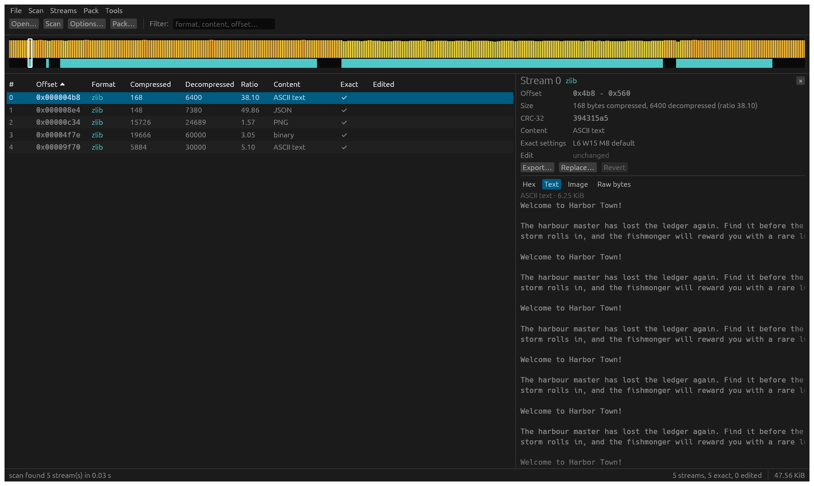
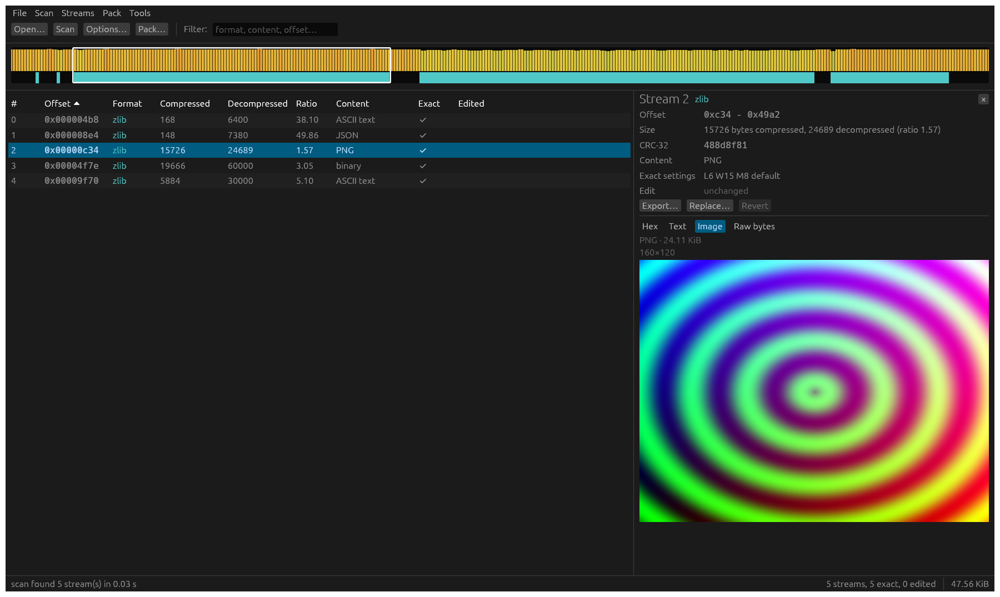
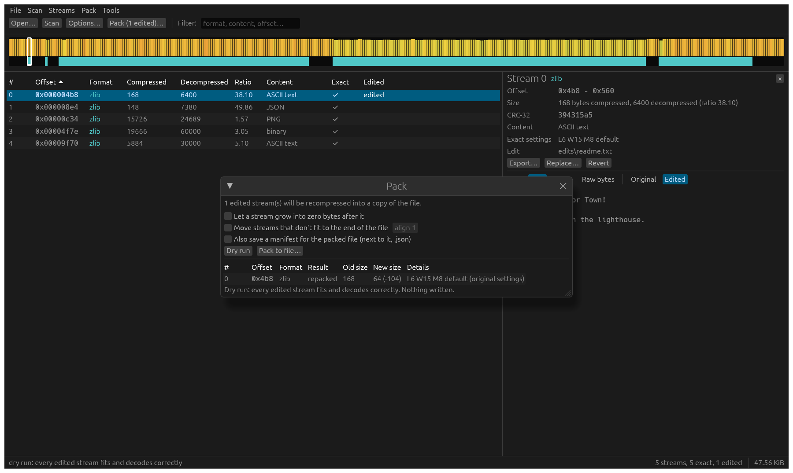

# zscan

Find compressed streams inside any binary file, extract them, edit them, and put them back.

zscan is a ground-up Rust replacement for Luigi Auriemma's offzip and packzip: one tool, driven by a JSON manifest, that checks every step. Unedited streams come back bit for bit, and a packed file is verified before it is written.

- **Scan** a file for gzip, zlib, raw deflate, zstd, xz, bzip2 and lz4 streams (plus brotli, LZO and Oodle when asked).
- **Extract** them to files, edit them, and **pack** them back into a copy of the input.
- **Unpack** a whole file into its decompressed contents and **rebuild** it bit for bit.
- A **desktop GUI** does the same with an entropy map, stream table and previews.



## Download

Windows x64 builds are on the [Releases](https://github.com/xRopers/zscan/releases) page. The zip holds `zscan.exe` (command line) and `zscan-gui.exe` (desktop app). The release builds include LZO and Oodle support.

## Build from source

Rust 1.95 or later (1.89 for the command line alone):

```bash
cargo build --release
```

The binaries land in `target/release/`. Optional codecs are cargo features, off by default:

| Feature | Adds |
|---------|------|
| `lzo`   | Raw LZO1X. Uses the `lzo1x` crate, which is GPL-2.0 like liblzo. |
| `oodle` | Oodle Kraken, Mermaid, Selkie and Leviathan, using your own oo2core library at run time. |

```bash
cargo build --release --features lzo,oodle
```

## Command line

```bash
zscan scan game.bin -o manifest.json        # find streams, write a manifest
zscan extract game.bin -m manifest.json -d out/
# ...edit files in out/...
zscan pack game.bin -m manifest.json -d out/ --dry-run   # per-stream size changes
zscan pack game.bin -m manifest.json -d out/ -o game.packed.bin
zscan info game.bin                         # summary and entropy map
```

Every command takes `--json` for scripting. The input file is never modified. Pack writes to a new file, decodes every stream in it again, and only then puts it in place.

Other commands:

| Command | What it does |
|---------|--------------|
| `zscan try FILE --at OFFSET --format F -m m.json` | Decode one format at an exact offset and add it to a manifest. For formats that can't be scanned for, or to check a location. |
| `zscan fields FILE -m m.json --apply` | Find fields that record a stream's size or offset (size prefixes, archive directories). Pack then keeps them up to date, and can move a stream that no longer fits (`--relocate`). |
| `zscan unpack FILE -d DIR` / `zscan rebuild DIR -o FILE` | Expand a file into its streams' contents plus whatever is needed to recreate it exactly (useful for storing it compressed better), and back. |

## How pack fits edited streams

During a scan, zscan looks for the encoder settings (level, window, strategy and so on) that reproduce each stream byte for byte, and records them in the manifest. When you edit a stream, pack re-encodes it with those same settings. If the result is too big for its slot, it tries stronger settings. If it still doesn't fit, it can use zero padding after the stream (`--use-slack`), or move the stream to the end of the file when length fields say where it is (`--relocate`). Otherwise it stops with a clear "N bytes over" message and writes nothing.

## Formats

| Format | Scanned by default | Notes |
|--------|-------------------|-------|
| gzip, zlib | yes | Checksums verified. |
| raw deflate | yes | No checksum, so stricter filters apply (minimum size, ratio, entropy). |
| zstd, xz, bzip2, lz4 frame | yes | |
| brotli | never | No magic number. Add streams with `zscan try --format brotli`. |
| LZO | `--formats ...,lzo` | Raw LZO1X. Found only where a field in the 16 bytes before the stream holds its compressed size. |
| Oodle | `--scan-oodle` | Needs your own library (below). Found only where a field in the 16 bytes before the stream holds its decompressed size. |

## Oodle

Oodle is proprietary, and zscan does not include it. Point zscan at the `oo2core_*.dll` that came with the game or SDK your file is from:

```bash
zscan --oodle-dll "C:\Games\Some Game\oo2core_9_win64.dll" scan game.bin --scan-oodle
```

You can also set the `ZSCAN_OODLE_DLL` environment variable. In the GUI, use **Tools > Plugins**.

An Oodle stream doesn't record its decompressed size, so zscan has to get it from somewhere else: from a size field in front of the stream when scanning, or from you:

```bash
zscan try game.bin --at 0x1234 --format oodle --decompressed-size @0x122c -m manifest.json
```

`@OFFSET` reads the size from the file (`@OFFSET:u32be` and so on for other widths). Once a stream is in the manifest, extract and pack work as for any other format. Kraken and Mermaid streams reject a wrong size; Leviathan streams may decode with a slightly wrong one, so the size you give is taken on trust.

## Desktop app

```bash
zscan-gui [--oodle-dll PATH] [FILE | project.zscan]
```

Open a file and scan it, then click a stream to preview it as hex, text or an image. Replace, export or revert streams, and use the Pack window for a dry run, then write and verify. Your work can be saved as a `.zscan` project.

The strip along the top is the file's entropy (orange is high), with the streams it found drawn below it.





## License

zscan is free software: you can redistribute it and/or modify it under the terms of the GNU General Public License as published by the Free Software Foundation, either version 2 of the License, or (at your option) any later version (GPL-2.0-or-later). The license text is in [LICENSE](LICENSE).

Some dependencies are under other licenses, which is why this is "or later":

- `preflate-rs` (bit-exact deflate reconstruction) and the GUI's window and OpenGL crates are Apache-2.0, and `cabac` (used by preflate-rs) is LGPL-3.0-or-later. A program that includes them can be distributed under GPL version 3, but not version 2 alone.
- The optional `lzo` feature uses the `lzo1x` crate, which declares GPL-2.0 without "or later". Check its terms before distributing binaries built with `lzo`.

Oodle is not part of zscan and is not covered by this license: zscan only loads the Oodle library you supply.
